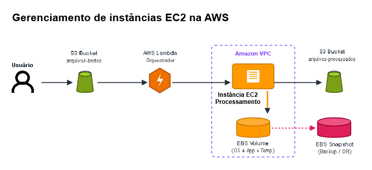

# Desafio DIO: Gerenciamento de Instâncias EC2 na AWS

Repositório foi criado para entrega do desafio da **DIO (Digital Innovation One)** sobre meu aprendizado sobre o **Amazon EC2** na **Formação AWS Cloud Foundations**

O objetivo do projeto foi entender como o EC2 funciona na prática, como ele se conecta com outros serviços da AWS e como garantir a segurança e o backup dos dados.

---

## 📐 Desenho da Arquitetura

Para exemplificar o uso do EC2 na prática, montei o diagrama abaixo mostrando um fluxo completo de processamento de arquivos:

---

## 🔄 Como funciona o fluxo (Passo a Passo)

1. **Upload do arquivo:** O usuário envia um arquivo para o **S3 Bucket** (`arquivos-brutos`).
2. **Gatilho automático:** O **AWS Lambda** detecta a chegada do arquivo e inicia o processo.
3. **Processamento no EC2:** O Lambda chama a instância **Amazon EC2** (que fica protegida dentro de uma **Amazon VPC**) para processar esse arquivo.
4. **Armazenamento no EBS:** O EC2 usa o disco **Amazon EBS** para ler e gravar os dados do processamento.
5. **Backup de Segurança:** É feito um **EBS Snapshot** periódico do disco para garantir cópias de segurança (Backup/DR).
6. **Entrega final:** O resultado é salvo no **S3 Bucket** (`arquivos-processados`).

---

## 💡 O que eu aprendi neste desafio

* **Amazon EC2:** Entendi que é o servidor virtual da AWS onde rodamos nossas aplicações.
* **Amazon EBS:** Aprendi que ele funciona como o "disco rígido" ou "pen-drive" do servidor EC2.
* **Snapshots:** Compreendi a importância de tirar "fotos" (backups) do disco EBS para evitar perda de dados.
* **VPC:** Percebi a importância de isolar os servidores em uma rede privada e segura.
* **AWS IAM:** Gerencia as permissões e papéis (Roles) de segurança, garantindo que os serviços acessem uns aos outros com segurança.
---
## 🤝 Conecte-se comigo!

Fique à vontade para visitar meu perfil, acompanhar meus projetos ou entrar em contato:

📧 **GitHub:** [HigorCamposGit](https://github.com/HigorCamposGit)
---
✨ *Projeto desenvolvido como parte dA **Formação AWS Cloud Foundations** *

